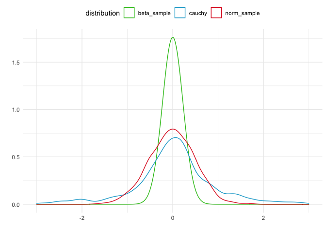
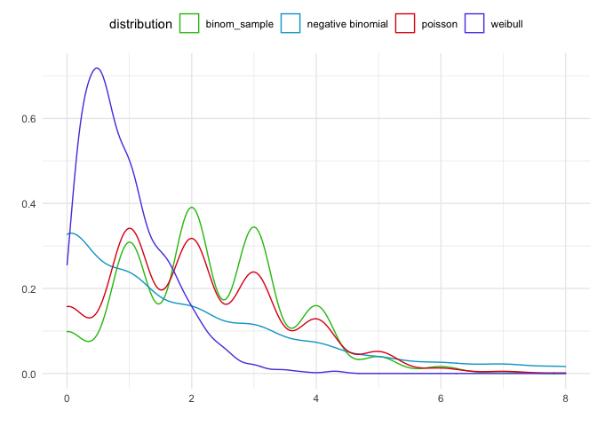

Distribution Sampling
================
Jesse Cambon
27 April, 2020

References: \* <http://appliedpredictivemodeling.com/data> \*
<http://faculty.marshall.usc.edu/gareth-james/ISL/data.html>

``` r
library(tidyverse)
library(bayestestR)
library(BayesFactor)

set.seed(42) # for reproducibility
```

Perform sampling

``` r
unif_sample <- runif(4000,-5,5)
norm_sample <- rnorm(5000,0,1)
binom_sample <- rbinom(10000,10,.5)
bernouli_sample <- rbernoulli(10,p=0.9)
poison_sample <- rpois(1000,5)
negbinomial_sample <- rnbinom(10000,1,mu=5)
beta_sample <- rbeta(1000,500,50)
```

``` r
ggplot(data=beta_sample %>% as_tibble()) + 
  geom_density(aes(x=value)) + theme_bw()
```

<!-- -->

``` r
ggplot(data=poison_sample %>% as_tibble()) + 
  geom_density(aes(x=value)) + theme_minimal() +
  geom_density(data=rnorm(2000,5,2.5) %>% as_tibble(),aes(x=value),color='navy') +
  geom_density(data=negbinomial_sample %>% as_tibble(),aes(x=value),color='red')
```

<!-- -->

T test on Tree data

``` r
t.test(trees$Height)
```

    ## 
    ##  One Sample t-test
    ## 
    ## data:  trees$Height
    ## t = 66.41, df = 30, p-value < 2.2e-16
    ## alternative hypothesis: true mean is not equal to 0
    ## 95 percent confidence interval:
    ##  73.6628 78.3372
    ## sample estimates:
    ## mean of x 
    ##        76

``` r
t.test(trees$Girth)
```

    ## 
    ##  One Sample t-test
    ## 
    ## data:  trees$Girth
    ## t = 23.506, df = 30, p-value < 2.2e-16
    ## alternative hypothesis: true mean is not equal to 0
    ## 95 percent confidence interval:
    ##  12.09731 14.39947
    ## sample estimates:
    ## mean of x 
    ##  13.24839

Simulate some data and run more T-tests

``` r
compare_norms <- rnorm(100,25,10) %>%
  as_tibble() %>% rename(sample1=value) %>%
  mutate(sample2 = rnorm(100,28,10))

library(broom)
results <- t.test(compare_norms$sample1,compare_norms$sample2)
results
```

    ## 
    ##  Welch Two Sample t-test
    ## 
    ## data:  compare_norms$sample1 and compare_norms$sample2
    ## t = -2.5571, df = 194.89, p-value = 0.01131
    ## alternative hypothesis: true difference in means is not equal to 0
    ## 95 percent confidence interval:
    ##  -6.9818046 -0.9016419
    ## sample estimates:
    ## mean of x mean of y 
    ##  24.99471  28.93644

``` r
tidy_results <- results %>% tidy()
tidy_results
```

    ## # A tibble: 1 x 10
    ##   estimate estimate1 estimate2 statistic p.value parameter conf.low conf.high
    ##      <dbl>     <dbl>     <dbl>     <dbl>   <dbl>     <dbl>    <dbl>     <dbl>
    ## 1    -3.94      25.0      28.9     -2.56  0.0113      195.    -6.98    -0.902
    ## # … with 2 more variables: method <chr>, alternative <chr>

Bayesian T-test

<https://easystats.github.io/bayestestR/articles/example2.html>

``` r
result <- BayesFactor::ttestBF(compare_norms$sample1,compare_norms$sample2)
describe_posterior(result)
```

    ##    Parameter    Median CI    CI_low   CI_high      pd ROPE_CI ROPE_low
    ## 1 Difference -3.703567 89 -6.207113 -1.341862 0.99575      89     -0.1
    ##   ROPE_high ROPE_Percentage       BF Prior_Distribution Prior_Location
    ## 1       0.1               0 3.181391             cauchy              0
    ##   Prior_Scale
    ## 1   0.7071068
