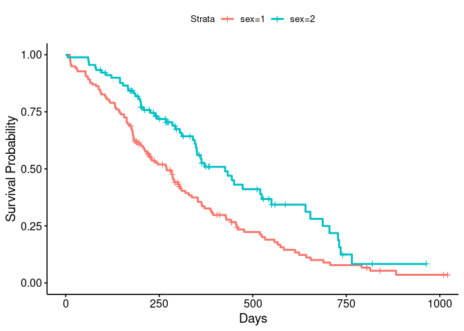
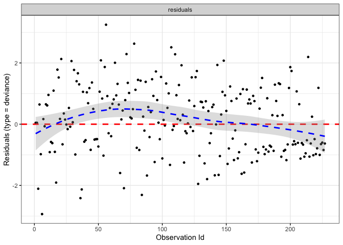
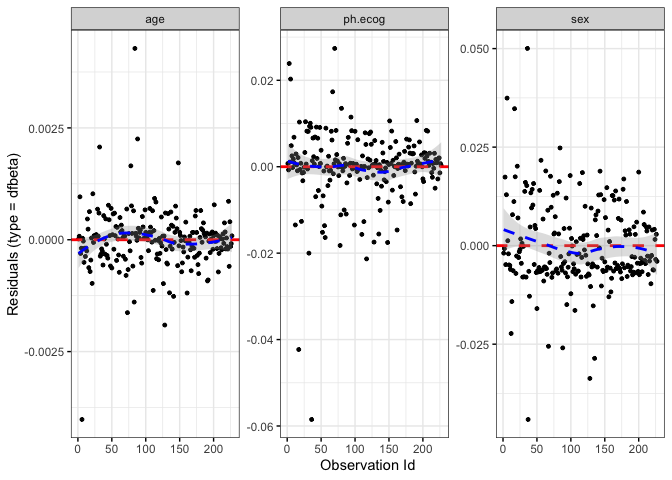
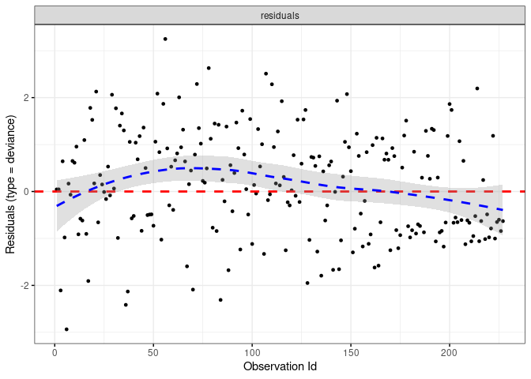

Survival Models
================
Jesse Cambon
31 December, 2020

  - [Kaplan-Meier](#kaplan-meier)
  - [Log-Rank Test](#log-rank-test)
  - [Cox Proportional Hazard Model](#cox-proportional-hazard-model)
      - [Model Validation](#model-validation)

Survival Analysis

  - Kaplan-Meier Plots
  - Log-rank test
  - Cox Proportional Hazard Model
  - Bayesian Approaches

Reference:

<https://www.emilyzabor.com/tutorials/survival_analysis_in_r_tutorial.html>

``` r
library(survival)
library(survminer)
library(tidyverse)
library(broom)
```

# Kaplan-Meier

status: censoring status 1=censored, 2=dead. Can also use TRUE/FALSE see
documentation for event in ?Surv

``` r
lung %>% count(status)
```

    ##   status   n
    ## 1      1  63
    ## 2      2 165

``` r
ggsurvplot(
    fit = survfit(Surv(time, status) ~ sex, data = lung), 
    xlab = "Days", 
    ylab = "Survival Probability")$plot
```

<!-- -->

# Log-Rank Test

Test if there was a statistically significant difference in survival
time between the groups

``` r
survdiff(Surv(time, status) ~ sex, 
         data = lung, 
         rho = 0 # log-rank, see ?survdiff
         )
```

    ## Call:
    ## survdiff(formula = Surv(time, status) ~ sex, data = lung, rho = 0)
    ## 
    ##         N Observed Expected (O-E)^2/E (O-E)^2/V
    ## sex=1 138      112     91.6      4.55      10.3
    ## sex=2  90       53     73.4      5.68      10.3
    ## 
    ##  Chisq= 10.3  on 1 degrees of freedom, p= 0.001

# Cox Proportional Hazard Model

  - Multivariate “semi-parametric” regression approach
  - Assumes hazard can change over time, but is proportional between
    groups at all points in time (ie. hazard ratio is constant over
    time).

<!-- end list -->

``` r
cox_fit <- coxph(Surv(time, status) ~ sex + age + ph.ecog,
        data = lung)

# Exponentiate coefficients to get hazard ratios
cox_hr <- tidy(cox_fit, exponentiate = TRUE, conf.int = TRUE)
```

Survival curve

``` r
ggsurvplot(survfit(cox_fit), data = lung, risk.table = TRUE)
```

<!-- -->

Plot Hazard Ratios

``` r
ggplot(data=cox_hr,
          aes(x = term, y = estimate)) +
geom_point() +
scale_y_continuous() +
geom_hline(yintercept=0,color='grey') +
coord_flip() +
  theme_bw() +
  theme(plot.title = element_text(lineheight=1, face="bold",hjust = 0.5)) +
geom_pointrange(mapping=aes(ymin=conf.low, ymax=conf.high)) + 
xlab('Term') + ylab('HR') + geom_hline(yintercept = 1, color = "grey")
```

<!-- -->

## Model Validation

Reference: <http://www.sthda.com/english/wiki/cox-model-assumptions>

Look at residuals

``` r
ggcoxdiagnostics(cox_fit, type = "deviance", ox.scale = 'observation.id')
```

    ## `geom_smooth()` using formula 'y ~ x'

<!-- -->

``` r
ggcoxdiagnostics(cox_fit, type = "deviance", ox.scale = 'linear.predictions')
```

    ## `geom_smooth()` using formula 'y ~ x'

<!-- -->

``` r
ggcoxdiagnostics(cox_fit, type = 'dfbeta')
```

    ## `geom_smooth()` using formula 'y ~ x'

<!-- -->

Test proportional hazards assumption

``` r
zph_fit <- cox.zph(cox_fit)
ggcoxzph(zph_fit)
```

<!-- -->
